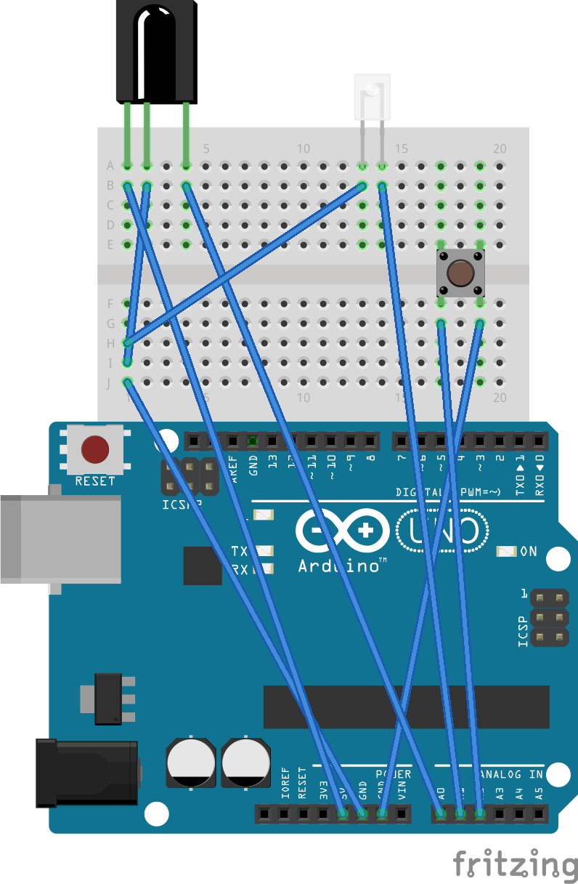

## LITE_VERSION
Данная версия предоставляет минимальный функционал, описанный в описании репозитория

## Компоненты:
- Arduino Uno
- ИК-приемник
- ИК-передатчик
- Кнопка
- Провода

## Диаграмма подключения компонентов к микроконтроллеру

